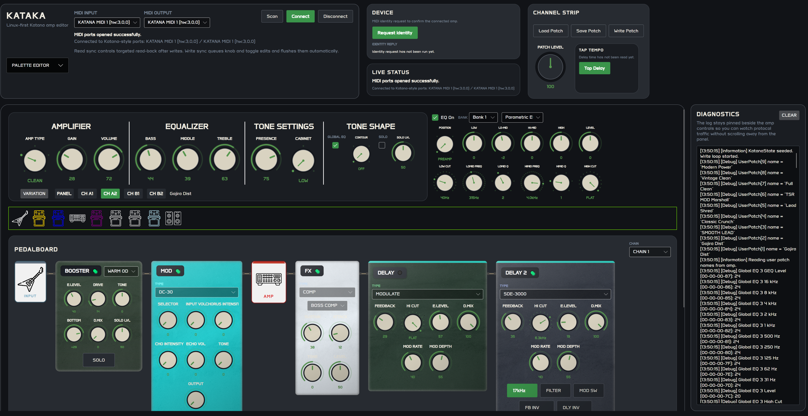

# Kataka

A Linux desktop editor for the **Boss Katana 50 MkII** guitar amplifier, written in C# with [Avalonia UI](https://avaloniaui.net/).



> **Work in progress.** Some things are missing, some things are untested. Use at your own risk.

> Yes, the name is a typo. It should be "Katana". I noticed too late and it had already grown on me, so here we are.

---

## What it does

Connects to your Katana 50 MkII over USB/MIDI and lets you edit your amp from a desktop UI — channels, effects chain (Booster, Mod, FX, Delay, Reverb, EQ, Noise Suppressor, Preamp), real-time knob feedback, and patch save/load as `.tsl` files (same format Boss Tone Studio uses).

All edits go to the amp live via Roland SysEx.

---

## Getting started

When the app opens it won't connect automatically. Hit **Scan** to find your MIDI ports, pick your Katana, and connect. Once connected the UI pulls the current state from the amp.

You can grab a pre-built binary from the [Releases](../../releases) page — no .NET install needed, it's self-contained.

---

## Compatibility

I built and tested this exclusively on **Fedora Linux** with my **Boss Katana 50 MkII**. That's the only hardware and OS I can vouch for. Other Katana models probably won't work — the SysEx address maps are specific to the 50 MkII and I have no way to test anything else.

---

## Why not just run Boss Tone Studio in Docker?

I know that's an option. I wanted to take a crack at a native Linux implementation. This is my weekend project.

---

## Requirements

- Boss Katana 50 MkII connected via USB
- Linux with `amidi` installed (`alsa-utils`)
- [.NET 10](https://dotnet.microsoft.com/download) (only if building from source — the release binary is self-contained)

---

## Building from source

```bash
git clone <repo-url>
cd katana50-mkII-linux
dotnet run --project src/Kataka.App/Kataka.App.csproj
```

---

## Contributing

Feel free to open a PR. If you have a Katana 50 MkII and want to help fill in missing parameters, fix something broken, or clean up the UI — all welcome.

This is my first real Avalonia project. The C# and architecture side I'm comfortable with, the AXAML/UI side not so much. If you spot something painful in the views, go for it.

On AI: I used it heavily for boilerplate and implementation details, but the architecture, data flow, MVVM patterns, pedalboard model, signal chain design, and overall direction are mine. I drove every decision in this codebase — AI was a tool, not a collaborator.

I haven't done it yet, but if someone wants to pull the infrastructure layer out into a reusable package — so it could be used with other amp models — I'm open to it. Same goes for adding support for other Katana models and re-architecting as needed. This is a pet project, I'm not precious about any of it.

---

## Attributions

I've done my best to credit all icons and assets — see the [Attributions](Attributions) file. If I missed something it wasn't intentional, open an issue or PR and I'll fix it.

---

## License

[GNU General Public License v3.0](LICENSE)

> Boss and Katana are trademarks of Roland Corporation. This project is not affiliated with or endorsed by Roland/Boss.
